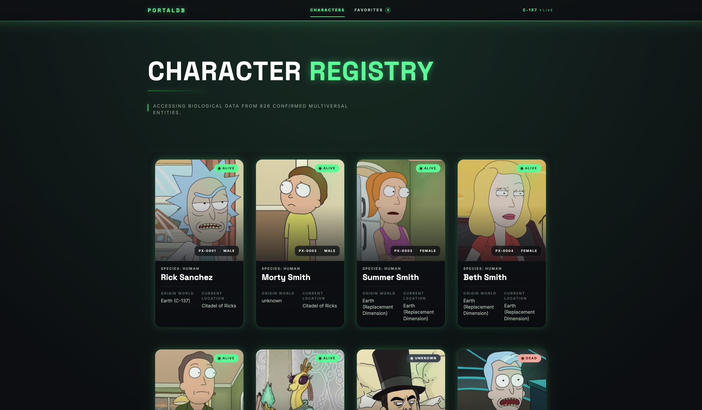
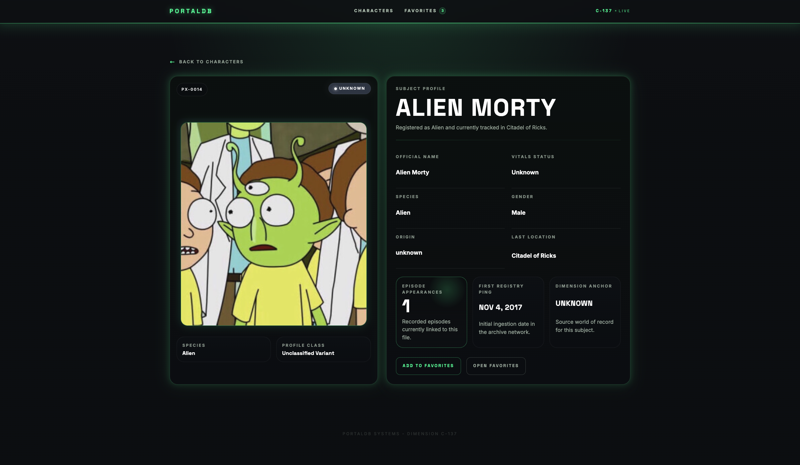
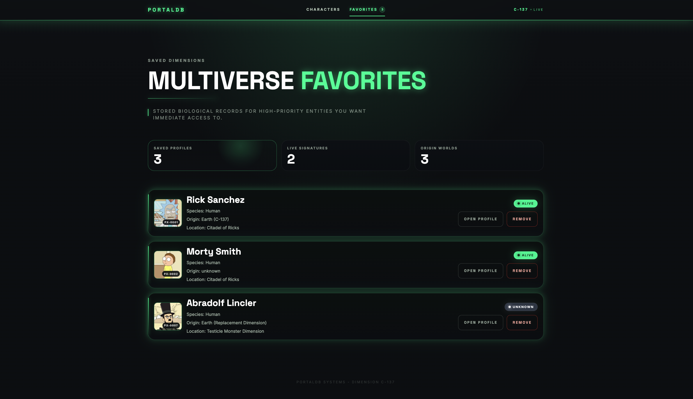

# Portaldb

Mini aplicación en Angular inspirada en el universo de Rick and Morty. La app consume la Rick and Morty API, renderiza la grilla principal con SSR, muestra una vista de detalle por personaje y gestiona favoritos persistidos con NgRx + `localStorage`.

## Highlights

- `/characters`: grilla responsive con SSR y paginación
- `/characters/:id`: detalle con más de 5 campos relevantes
- `/favorites`: listado de favoritos persistidos
- NgRx Store + Effects con persistencia en `localStorage`
- Proxy Express para consumo de API sin problemas de CORS
- Dockerfile multi-stage para ejecución local en contenedor

## Screenshots





## Why this project

Portaldb está pensado como una SPA moderna con foco en experiencia de usuario y fundamentos frontend sólidos: renderizado híbrido, manejo de estado predecible, persistencia local y una estructura mantenible basada en features.

## Key technical decisions

- SSR en `/characters` para entregar contenido útil desde la primera respuesta y mejorar la carga inicial de la vista principal.
- `RenderMode.Client` en `/favorites` porque depende de estado persistido localmente en navegador.
- NgRx para centralizar favoritos, reflejar el estado en múltiples vistas y simplificar la persistencia.
- Proxy Express en `/api/*` para unificar el consumo de datos entre SSR y CSR y evitar problemas de CORS.
- Separación por features para mantener rutas, páginas y estado agrupados por dominio.

## Stack técnico

- Angular 21
- Angular SSR con `@angular/ssr`
- Standalone components
- NgRx Store + Effects
- Express para SSR y proxy de API
- Vitest para unit tests
- Docker multi-stage build

## Arquitectura resumida

- `src/app/features/characters`: grilla SSR con paginación.
- `src/app/features/character-detail`: detalle del personaje.
- `src/app/features/favorites`: listado de favoritos persistidos.
- `src/app/store/favorites`: acciones, reducer, selectors y effects de NgRx.
- `src/app/core/services/characters.service.ts`: consumo de API.
- `src/server.ts`: servidor Express SSR y proxy hacia Rick and Morty API.
- `src/app/app.routes.server.ts`: estrategia de render por ruta.

## Cómo ejecutar localmente

### Prerrequisitos

- Node.js 20 o superior
- npm 10 o superior

### Instalación

```bash
npm install
```

### Desarrollo

```bash
npm start
```

La app queda disponible en `http://localhost:4200`.

### Ejecución SSR

Para levantar la versión compilada con SSR:

```bash
npm run build
npm run serve:ssr:portaldb
```

La app queda disponible en `http://localhost:4000`.

Si el puerto `4000` ya está ocupado, puedes usar otro:

```bash
PORT=4010 npm run serve:ssr:portaldb
```

## Scripts disponibles

```bash
npm start                # servidor de desarrollo
npm run build            # build browser + server
npm test -- --watch=false
npm run serve:ssr:portaldb
```

## Technical validation

### 1. Validar SSR en la grilla

Luego abre `http://localhost:4000/characters` o valida por consola:

```bash
curl -s http://localhost:4000/characters | grep "Rick Sanchez"
```

Si el HTML ya contiene personajes antes de hidratar en navegador, la grilla está siendo entregada con SSR.

Si levantaste el servidor con otro puerto, reemplaza `4000` por el puerto elegido.

### 2. Validar detalle

Abre cualquier personaje desde la grilla o entra directo a una ruta como:

```bash
http://localhost:4000/characters/1
```

La vista muestra más de 5 campos relevantes, incluyendo nombre, estado, especie, género, origen, ubicación, episodios y fecha de creación.

### 3. Validar favoritos persistidos

1. Entra al detalle de un personaje.
2. Presiona `Add To Favorites`.
3. Ve a `/favorites` y confirma que aparece en la lista.
4. Recarga la aplicación.
5. Verifica que el favorito siga presente.

La persistencia se realiza con NgRx y `localStorage` bajo la clave `portaldb_favorites`.

## Docker

Construcción de imagen:

```bash
docker build -t portaldb .
```

Ejecución del contenedor:

```bash
docker run --rm -p 4000:4000 portaldb
```

Luego abre `http://localhost:4000`.

## Variable de entorno opcional

El servidor SSR permite redefinir la API upstream:

```bash
RICK_API_URL=https://rickandmortyapi.com/api
```

Si no se define, usa ese valor por defecto.

## Validaciones ejecutadas

Se verificó localmente lo siguiente:

- `npm run build`
- `npm test -- --watch=false`
- Respuesta `200 OK` en `/characters` levantando el servidor SSR compilado
- HTML SSR con personajes renderizados en la respuesta inicial

## Notas de implementación

- La página de favoritos está marcada como `RenderMode.Client` porque depende del estado persistido localmente en el navegador.
- La grilla y el detalle sí están configurados con renderizado de servidor.
- El proxy en Express evita problemas de CORS y mantiene un único origen tanto para SSR como para CSR.
